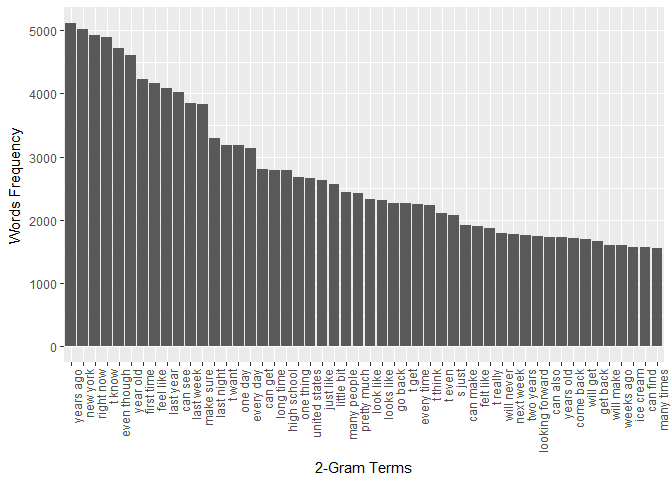
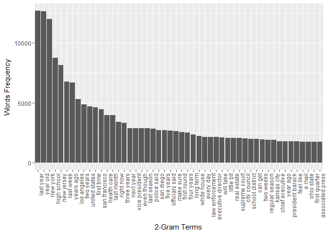

# Data Science Capstone -- Text Predictive Model

# Introduction

In this project, we are going to develop a text typing helper app which tries to predict and pop-up what user will type next.  The model will be trained by data collected in various twitter sites, blogs and news website.  We first perform some exploratory analysis here before continue to develop the predictive model. 

# Libraries

Here are the libraries we needed.


```r
library(dplyr)
library(tidyr)
library(knitr)
library(ggplot2)
library(ggrepel)
library(tm)
library(wordcloud)
options(digits = 9)
```


# Splitting Data

First, we need to partition the data into training and validation set.  Since the data size is very big, it is sufficient to set the test size to validation size to 99:1.  In that way, we can have the model developed by the training set to be more robust. We define __partitionTextFile__ function below to perform the task:


```r
partitionTextFile <- function(file.name, validation.p = 0.01){
  
  con <- file(file.name, "r") 
  x <- readLines(con)
  close(con)
  
  valid.pos <- sample(1:length(x), size = 
      round(length(x) * validation.p, 0))
  
  train_set <- x[-valid.pos]  
  valid_set <- x[valid.pos]
  
  train_file_name <- gsub('.txt', '_train.txt', file.name)
  valid_file_name <- gsub('.txt', '_valid.txt', file.name)
  
  write(x = train_set, file = train_file_name)
  write(x = valid_set, file = valid_file_name)
}

#Applying the function
set.seed(12345)
file.names <- paste(base_wd, c('en_US.news.txt', 'en_US.blogs.txt', 'en_US.twitter.txt'), sep = "")
for(i in 1:length(file.names)){
  partitionTextFile(file.name = file.names[i], 0.01)
}
```

# Map-Reduce System to Tokenize the data

There is a special phase that I used python mapper and reducer framework to tokenize the data.  The whole system performs the following tasks:

1. Convert all alphabetic characters to lower case
2. Substituting all the non-alphabetic characters (except "'") to space 
3. Split the string by space into tokens
4. In each tokens, insert a special token "s1" before the start of a sentence or "e1" after the end of a sentence
5. Reducer -- Aggregation:
  i. Mono-gram: Sort, group and count the tokens
  ii. Bi-gram: Sort, group tokens in pairs and count the pairs occurrence

# Clean up of tokens

After the basic tokenize functions, we perform last step that replacing the "'" except the words involved in contraction see https://en.wikipedia.org/wiki/Contraction_(grammar).  The function is defined as below:

Note that __twitter_unigrams_df__ and __twitter_bigrams_df__ are our monogram and bigram input.


```r
cleaningQuote <- function(my_df, col.names){

# Replace the "'" characters except the contractions
# contractions: "n't" , "'s", "i'm", "'ve", "'d", "'ll", "o'"

  for(i in 1:length(col.names)){
    
    dummy_str <- as.vector(my_df[[col.names[i]]])
    
    contraction_flag1 <- grepl("^.*(n\\'t)$", dummy_str)
    contraction_flag2 <- grepl("^.*(\\'s)$", dummy_str)
    contraction_flag3 <- grepl("^i\\'m$", dummy_str)
    contraction_flag4 <- grepl("^.*(\\'ve)$", dummy_str)
    contraction_flag5 <- grepl("^.*(\\'d)$", dummy_str)
    contraction_flag6 <- grepl("^.*(\\'ll)$", dummy_str)
    contraction_flag7 <- grepl("^(o\\').*$", dummy_str)
    
    contraction_flags <- contraction_flag1 | contraction_flag2 | contraction_flag3 |
      contraction_flag4 | contraction_flag5 | contraction_flag6 | contraction_flag7
    
    dummy_str[!contraction_flags] <- gsub("'", "", x = dummy_str[!contraction_flags]) 
    
    #Replace <s1> by s1 and <e1> by e1 because of the html problem etc.
    dummy_str <- gsub('<s>', 's1', dummy_str)
    dummy_str <- gsub('<e>', 'e1', dummy_str)
    dummy_str <- gsub('<|>', '', dummy_str)
    
    my_df[, names(my_df) == col.names[i]] <- dummy_str
    
  }
  
  return(my_df)
}
```

Now, let's apply this function to clean up the quotes and data frame the tokens tables.


```r
#blogs
blogs_unigrams_df        <- read.table(paste(base_wd, 'blogs_uni_tokens_train_py.txt', sep =""),
  sep = "\t", header = F,  quote = "\"",  stringsAsFactors = FALSE)
names(blogs_unigrams_df) <- c('Token', 'cnt')

blogs_unigrams_df <- cleaningQuote(blogs_unigrams_df, col.names = 'Token')
blogs_unigrams_df <- blogs_unigrams_df %>% group_by(Token) %>% summarise(cnt = sum(cnt)) %>% ungroup()
blogs_unigrams_df <- blogs_unigrams_df %>% arrange(desc(cnt))

blogs_bigrams_df        <- read.table(paste(base_wd, 'blogs_bi_tokens_train_py.txt', sep =""),
  sep = "\t", header = F,  quote = "\"",  stringsAsFactors = FALSE)
names(blogs_bigrams_df) <- c('Token1', 'Token2', 'cnt')

blogs_bigrams_df <- cleaningQuote(blogs_bigrams_df, col.names = c('Token1', 'Token2'))
blogs_bigrams_df <- blogs_bigrams_df %>% group_by(Token1, Token2) %>% summarise(cnt = sum(cnt)) %>% ungroup()
blogs_bigrams_df <- blogs_bigrams_df %>% arrange(desc(cnt))


#twitter
twitter_unigrams_df        <- read.table(paste(base_wd, 'twitter_uni_tokens_train_py.txt', sep =""),
  sep = "\t", header = F,  quote = "\"",  stringsAsFactors = FALSE)
names(twitter_unigrams_df) <- c('Token', 'cnt')

twitter_unigrams_df <- cleaningQuote(twitter_unigrams_df, col.names = 'Token')
twitter_unigrams_df <- twitter_unigrams_df %>% group_by(Token) %>% summarise(cnt = sum(cnt)) %>% ungroup()
twitter_unigrams_df <- twitter_unigrams_df %>% arrange(desc(cnt))

twitter_bigrams_df        <- read.table(paste(base_wd, 'twitter_bi_tokens_train_py.txt', sep =""),
  sep = "\t", header = F,  quote = "\"",  stringsAsFactors = FALSE)
names(twitter_bigrams_df) <- c('Token1', 'Token2', 'cnt')

twitter_bigrams_df <- cleaningQuote(twitter_bigrams_df, col.names = c('Token1', 'Token2'))
twitter_bigrams_df <- twitter_bigrams_df %>% group_by(Token1, Token2) %>% summarise(cnt = sum(cnt)) %>% ungroup()
twitter_bigrams_df <- twitter_bigrams_df %>% arrange(desc(cnt))

#news
news_unigrams_df        <- read.table(paste(base_wd, 'news_uni_tokens_train_py.txt', sep =""),
  sep = "\t", header = F,  quote = "\"",  stringsAsFactors = FALSE)
names(news_unigrams_df) <- c('Token', 'cnt')

news_unigrams_df <- cleaningQuote(news_unigrams_df, col.names = 'Token')
news_unigrams_df <- news_unigrams_df %>% group_by(Token) %>% summarise(cnt = sum(cnt)) %>% ungroup()
news_unigrams_df <- news_unigrams_df %>% arrange(desc(cnt))

news_bigrams_df        <- read.table(paste(base_wd, 'news_bi_tokens_train_py.txt', sep =""),
  sep = "\t", header = F,  quote = "\"",  stringsAsFactors = FALSE)
names(news_bigrams_df) <- c('Token1', 'Token2', 'cnt')

news_bigrams_df <- cleaningQuote(news_bigrams_df, col.names = c('Token1', 'Token2'))
news_bigrams_df <- news_bigrams_df %>% group_by(Token1, Token2) %>% summarise(cnt = sum(cnt)) %>% ungroup()
news_bigrams_df <- news_bigrams_df %>% arrange(desc(cnt))


#Save as .csv files
write.csv(blogs_unigrams_df, paste(base_wd, 'blogs_uni_tokens_train_py.csv', sep =""), row.names = F)
write.csv(blogs_bigrams_df, paste(base_wd, 'blogs_bi_tokens_train_py.csv', sep =""), row.names = F)

write.csv(twitter_unigrams_df, paste(base_wd, 'twitter_uni_tokens_train_py.csv', sep =""), row.names = F)
write.csv(twitter_bigrams_df, paste(base_wd, 'twitter_bi_tokens_train_py.csv', sep =""), row.names = F)

write.csv(news_unigrams_df, paste(base_wd, 'news_uni_tokens_train_py.csv', sep =""), row.names = F)
write.csv(news_bigrams_df, paste(base_wd, 'news_bi_tokens_train_py.csv', sep =""), row.names = F)

#Save as .RData
save(blogs_unigrams_df, blogs_bigrams_df,
  twitter_unigrams_df, twitter_bigrams_df,
  news_unigrams_df, news_bigrams_df, file = paste(base_wd, 'tokens_df.RData', sep =""))
```


Let's take a look on the first few elements of the twitter uni-gram and bi-gram data frame.


Token          cnt
------  ----------
s1       4,039,191
e1       4,028,292
the        928,510
to         780,904
i          720,698
a          610,760
you        544,098
and        434,252
for        381,607
in         376,915


Token1   Token2        cnt
-------  -------  --------
s1       i         331,304
in       the        77,611
for      the        73,205
s1       thanks     71,240
it       e1         70,747
you      e1         67,896
s1       the        67,109
s1       you        66,959
s1       i'm        64,803
s1       rt         63,419

Although s1 and e1 are not exactly paired up, their numbers are closed enough to proceed.


# Dictionary & Stop Words Check

Let's check how many of them are English words from a standard dictionary.  We grab this from a simple dictionary online from https://github.com/dwyl/English-words with 350 thousands words plus.  Note that, it doesn't contain complicated words so it only serves for a proxy for us to compare our three difference source ( __twitter__, __news__, __blogs__ ).

Also, a lot of common words such as "I'm", "We", "there", "the" etc. don't tell any thing about the articles.  In view of that, we filter a list of "stop words" from the __tm__ package.

To enhance flexibility, we flag those tokens here rather than a direct filtering.


```r
#loading dictionary by line
con <- file(paste(base_wd, "simple_words.txt", sep = ""), "r") 
my_dictionary <- readLines(con)
close(con)

stopwords <- tm::stopwords()

flagTokens <- function(my_df, col.names, dictionary, stopwords){
  
  for(i in 1:length(col.names)){
    
     dummy_str <- as.vector(my_df[[col.names[i]]])
     Eng_Word_new  <- dummy_str %in% dictionary | grepl("^(.)*'", x = dummy_str)
     Stop_Word_new <- dummy_str %in% stopwords
     
     if(i > 1){
       
       Eng_Word  <- Eng_Word  | Eng_Word_new
       Stop_Word <- Stop_Word | Stop_Word_new
       
     }else{
       
       Eng_Word  <- Eng_Word_new
       Stop_Word <- Stop_Word_new
       
     }
     
  }
  
  my_df$Eng_Word <- Eng_Word
  my_df$Stop_Word <- Stop_Word
  
  return(my_df)
}

blogs_unigrams_df <- flagTokens(blogs_unigrams_df, col.names = c('Token'), 
  dictionary = my_dictionary, stopwords = stopwords)

blogs_bigrams_df <- flagTokens(blogs_bigrams_df, col.names = c('Token1', 'Token2'),
  dictionary = my_dictionary, stopwords = stopwords)


twitter_unigrams_df <- flagTokens(twitter_unigrams_df, col.names = c('Token'), 
  dictionary = my_dictionary, stopwords = stopwords)

twitter_bigrams_df <- flagTokens(twitter_bigrams_df, col.names = c('Token1', 'Token2'), 
  dictionary = my_dictionary, stopwords = stopwords)

news_unigrams_df <- flagTokens(news_unigrams_df, col.names = c('Token'), 
  dictionary = my_dictionary, stopwords = stopwords)

news_bigrams_df <- flagTokens(news_bigrams_df, col.names = c('Token1', 'Token2'),
  dictionary = my_dictionary, stopwords = stopwords)


#Save as .RData
save(blogs_unigrams_df, blogs_bigrams_df,
  twitter_unigrams_df, twitter_bigrams_df,
  news_unigrams_df, news_bigrams_df, file = paste(base_wd, 'ngrams_df.RData', sep =""))
```

# Basic Statistics

Now, let's explore some basic statistics in those three different training set.


```r
con <- file(paste(base_wd, "en_US.blogs_train.txt", sep = ""), "r") 
train_set <- readLines(con)
close(con)
blogs_num_of_lines <- length(train_set)
rm(train_set)

con <- file(paste(base_wd, "en_US.twitter_train.txt", sep = ""), "r") 
train_set <- readLines(con)
close(con)
twitter_num_of_lines <- length(train_set)
rm(train_set)

con <- file(paste(base_wd, "en_US.news_train.txt", sep = ""), "r") 
train_set <- readLines(con)
close(con)
news_num_of_lines <- length(train_set)
rm(train_set)

basic_stat <- data.frame(source = c('Blogs', 'Twitter', 'News'))
basic_stat$Paragraphs <- c(blogs_num_of_lines, twitter_num_of_lines, news_num_of_lines)
basic_stat$Sentences <- c(
  sum(blogs_unigrams_df$cnt[blogs_unigrams_df$Token != 'e1']),
  sum(twitter_unigrams_df$cnt[twitter_unigrams_df$Token != 'e1']),
  sum(news_unigrams_df$cnt[news_unigrams_df$Token != 'e1']))
basic_stat$Tokens <- c(
  sum(blogs_unigrams_df$cnt[blogs_unigrams_df$Token != 's1' & blogs_unigrams_df$Token != 'e1']),
  sum(twitter_unigrams_df$cnt[twitter_unigrams_df$Token != 's1' & twitter_unigrams_df$Token != 'e1']),
  sum(news_unigrams_df$cnt[news_unigrams_df$Token != 's1' & news_unigrams_df$Token != 'e1']))

basic_stat$`Sentence per Paragraphs` <-  round(basic_stat$Sentence/basic_stat$Paragraphs, 2)
basic_stat$`Tokens per Sentence`     <-  round(basic_stat$Tokens/basic_stat$Sentences, 2)
basic_stat$`Stop Words` <- c(
  sum(blogs_unigrams_df$cnt[blogs_unigrams_df$Stop_Word]),
  sum(twitter_unigrams_df$cnt[twitter_unigrams_df$Stop_Word]),
  sum(news_unigrams_df$cnt[news_unigrams_df$Stop_Word]))

basic_stat$`English Words` <- c(
  sum(blogs_unigrams_df$cnt[blogs_unigrams_df$Eng_Word & !blogs_unigrams_df$Stop_Word & 
      blogs_unigrams_df$Token != 's1' & blogs_unigrams_df$Token != 'e1']),
  sum(twitter_unigrams_df$cnt[twitter_unigrams_df$Eng_Word & !twitter_unigrams_df$Stop_Word &
      twitter_unigrams_df$Token != 's1' & twitter_unigrams_df$Token != 'e1']),
  sum(news_unigrams_df$cnt[news_unigrams_df$Eng_Word & !news_unigrams_df$Stop_Word &
      news_unigrams_df$Token != 's1' & news_unigrams_df$Token != 'e1']))

basic_stat$`English Words %` <- round(basic_stat$`English Words`/(basic_stat$Tokens - basic_stat$`Stop Words`), 2)
```


```r
kable(basic_stat, format.args = list(big.mark = ','))
```


source     Paragraphs    Sentences       Tokens   Sentence per Paragraphs   Tokens per Sentence   Stop Words   English Words   English Words %
--------  -----------  -----------  -----------  ------------------------  --------------------  -----------  --------------  ----------------
Blogs         890,295   39,677,177   37,198,663                     44.57                  0.94   17,738,257      18,689,916              0.96
Twitter     2,336,547   33,490,386   29,451,195                     14.33                  0.88   12,493,199      15,604,909              0.92
News        1,000,141   35,987,329   33,751,240                     35.98                  0.94   14,010,117      18,601,683              0.94

We have a very nice result that after subtracting stop words, our English words % (over all tokens) are as high as 92% - 96%. __Blogs__ and __news__ as expected have a higher sentences per paragraphs (measured by lines or technically escape character"\\n").  Tokens per sentence is about the same except twitter has a little bit shorter sentence (0.94 vs. 0.88).


# Word Cloud

Let's explore the word cloud of each source.

## Blogs

<!-- -->

## Twitter

<!-- -->

## News

<!-- -->

Interestingly, __twitter__ and __blogs__ are very similar with words such as "like", "time", "love", "thanks", "one" etc. __twitter__ also has its own popular words such as "haha" and "rt" (retweet). On the other hand, in __news__, a very significantly dominating word is "said".  

# Histogram of 2-Gram Terms

## Blogs

Let's also explore the 2-gram level terms. "New York", "right now"", "years ago" are the most frequent terms in __blogs__.  "Right now" and "last night" are the most frequent terms in __twitter__. "New York", "years old" and "last year" are the most frequent terms in __news__,


<!-- -->

## Twitter

<!-- -->


## News

<!-- -->
